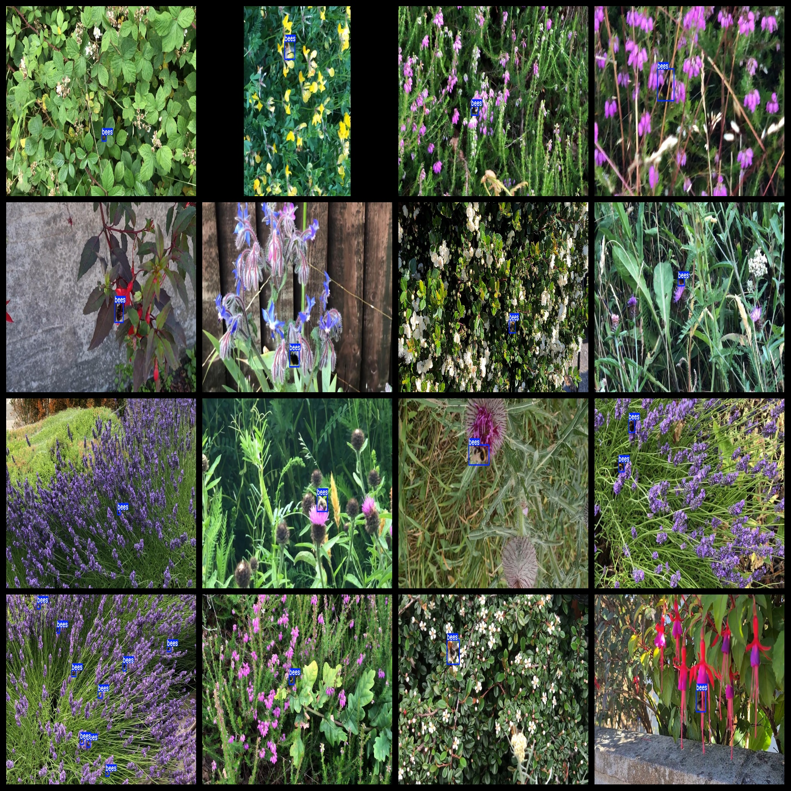
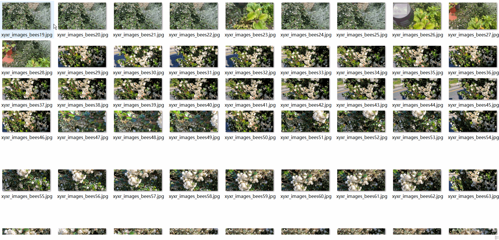

# Picking honey Scene Bawah Bee Detection Dataset 6640 imagesVOC+YOLO format

Honeypot bee detection dataset 6640 VOC + YOLO format

Dataset format: Pascal VOC format + YOLO format (the txt file does not contain the split path, it only contains jpg images and corresponding VOC format xml files and yolo format txt files)

Number of images (total number of jpg files): 6640

Number of XML files: 6640

Number of txt files: 6640

Number of categories: 1

The Github repository is: datasets_sl

Annotation class names: ["bees"]

Number of boxes labeled in each category:

Bees Frames = 9508

Total frames: 9508

Number of images per category:

Bees occupying the picture number = 6640

Image resolution: 1280x720

Use the labeling tool: labelImg

Dataset Augmentation: No

Rules for annotation: Draw a rectangle around the category.

Important note: The dataset does not have been divided into training, validation, and testing sets.

Special Disclaimer: This dataset does not guarantee the accuracy of the trained models or weight files.

Annotation and image details are as follows:

## Images

---

Here is a pay link on Stripe (https://buy.stripe.com/3cs8yP7sY87d0vu9AB). Please contact me lonlonago@foxmail.com after funding $89, and I will send you a complete data files, thank you!

